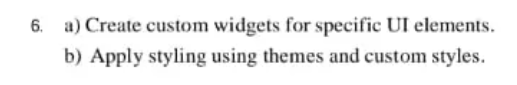
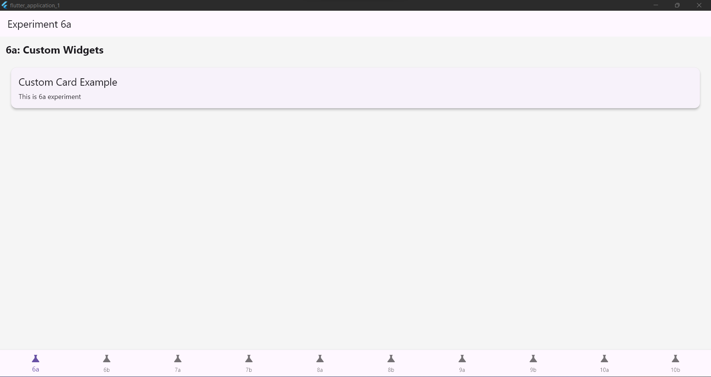
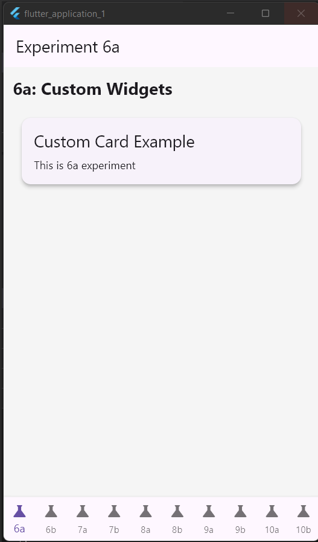

> “In this program, we are learning how to create **custom widgets** and apply **themes** in Flutter.
> Widgets are the building blocks of a Flutter app.
> We’ll see how to make our own widgets — `CustomCard` and `CustomAvatar` — and how they can use app-wide styles from themes.”

---

## 🔹 **Part 1: The `CustomCard` Widget**

### **Code**

```dart
import 'package:flutter/material.dart';
```

🗣 **Explain:**
“This line imports the Flutter Material package, which gives us access to ready-made UI components like `Card`, `Text`, and `Padding`. Without this, we can’t use Flutter’s visual widgets.”

---

```dart
class CustomCard extends StatelessWidget {
```

🗣 **Explain:**
“We are creating a new class called `CustomCard`.
It extends `StatelessWidget`, meaning it doesn’t change once it’s built. It’s used for static content.”

---

```dart
final String title;
final String? subtitle;
```

🗣 **Explain:**
“These are **properties** of our widget.

* `title` is required and will always have a value.
* `subtitle` is optional (`String?` means it can be null).
  This makes our widget more flexible.”

---

```dart
const CustomCard({super.key, required this.title, this.subtitle});
```

🗣 **Explain:**
“This is the **constructor** of the widget.
It allows us to pass values when creating the widget — for example:
`CustomCard(title: 'Student Info', subtitle: 'Roll No: 21CS101')`.”

---

```dart
@override
Widget build(BuildContext context) {
```

🗣 **Explain:**
“Every widget in Flutter has a `build` method.
It returns the UI layout that will appear on the screen.”

---

```dart
return Card(
  margin: const EdgeInsets.all(12),
```

🗣 **Explain:**
“Here we’re returning a **Card widget** — a container with rounded corners and shadow.
`margin` adds space around the card so it doesn’t touch the screen edges.”

---

```dart
child: Padding(
  padding: const EdgeInsets.all(16),
```

🗣 **Explain:**
“`Padding` adds inner space inside the card, so the text doesn’t stick to the edges.”

---

```dart
child: Column(
  crossAxisAlignment: CrossAxisAlignment.start,
  children: [
```

🗣 **Explain:**
“A `Column` arranges widgets **vertically**.
`crossAxisAlignment.start` aligns them to the left side.”

---

```dart
Text(title, style: Theme.of(context).textTheme.titleLarge),
```

🗣 **Explain:**
“This displays the **title text**.
It uses the app’s **theme style** — so if we change the theme color or font, this text updates automatically.”

---

```dart
if (subtitle != null) ...[
  const SizedBox(height: 8),
  Text(subtitle!),
]
```

🗣 **Explain:**
“This checks if a subtitle was given.
If yes, it adds some space (`SizedBox`) and then shows the subtitle text.
The `...` syntax is used to insert a list of widgets conditionally.”

---

## 🔹 **Part 2: The `CustomAvatar` Widget**

```dart
class CustomAvatar extends StatelessWidget {
```

🗣 **Explain:**
“This defines another widget, `CustomAvatar`, also a `StatelessWidget`.
It will display a circular profile with initials.”

---

```dart
final String name;
final double size;
```

🗣 **Explain:**
“`name` is required, and `size` controls how big the circle will be.
We can adjust `size` when using this widget.”

---

```dart
const CustomAvatar({super.key, required this.name, this.size = 48});
```

🗣 **Explain:**
“The constructor lets us pass the name and optional size.
If we don’t give a size, it defaults to 48.”

---

```dart
final initials = name.trim().isEmpty
    ? '?'
    : name
        .trim()
        .split(RegExp(r"\s+"))
        .where((s) => s.isNotEmpty)
        .map((s) => s[0])
        .take(2)
        .join();
```

🗣 **Explain:**
“This logic extracts the **initials** from the name.
For example, ‘Satish Bhasker’ → `SB`.
If the name is empty, it shows a question mark (`?`).”

---

```dart
return CircleAvatar(
  radius: size / 2,
  child: Text(initials,
      style: TextStyle(fontSize: size / 2.6, fontWeight: FontWeight.bold)),
);
```

🗣 **Explain:**
“`CircleAvatar` creates a circular icon.
It displays the initials inside, styled with bold text.
The size is calculated dynamically using the `size` property.”

---

## 🔹 **Part 3: Using Themes (6b)**

```dart
theme: ThemeData(
  primarySwatch: Colors.indigo,
  cardColor: Colors.indigo.shade50,
  textTheme: const TextTheme(
    titleLarge: TextStyle(fontSize: 22, fontWeight: FontWeight.bold, color: Colors.indigo),
    bodyMedium: TextStyle(fontSize: 16, color: Colors.black87),
  ),
),
```

🗣 **Explain:**
“This is where we define **global app styling** using a Theme.

* `primarySwatch` sets the main app color.
* `cardColor` defines the background for cards.
* `textTheme` defines font sizes, weights, and colors.

All widgets (like `CustomCard`) automatically pick these theme styles using
`Theme.of(context)`.”

---

## 🔹 **Part 4: Example Usage**

```dart
CustomAvatar(name: "Satish Bhasker"),
CustomCard(title: "Flutter Lab", subtitle: "Custom Widgets and Themes"),
```

🗣 **Explain:**
“Here we are using our custom widgets.
They’ll appear styled according to the app theme.
This shows the power of reusability — we can use these widgets anywhere easily.”

---

## 🏁 **Conclusion (to end your explanation)**

> “So in this program, we learned:
>
> * How to **create reusable custom widgets** (`CustomCard`, `CustomAvatar`).
> * How to use **themes** to maintain consistent colors and fonts.
> * How widgets inherit styles from the app’s theme automatically.
>   This helps build clean, modular, and visually consistent Flutter apps.”

---

Would you like me to make this into a **spoken script** (like what exactly to say while showing code line-by-line in class)?
That version would be very natural and teacher-friendly for oral explanation.

<!-- Desktop View -->
 

<!-- Mobile View -->
